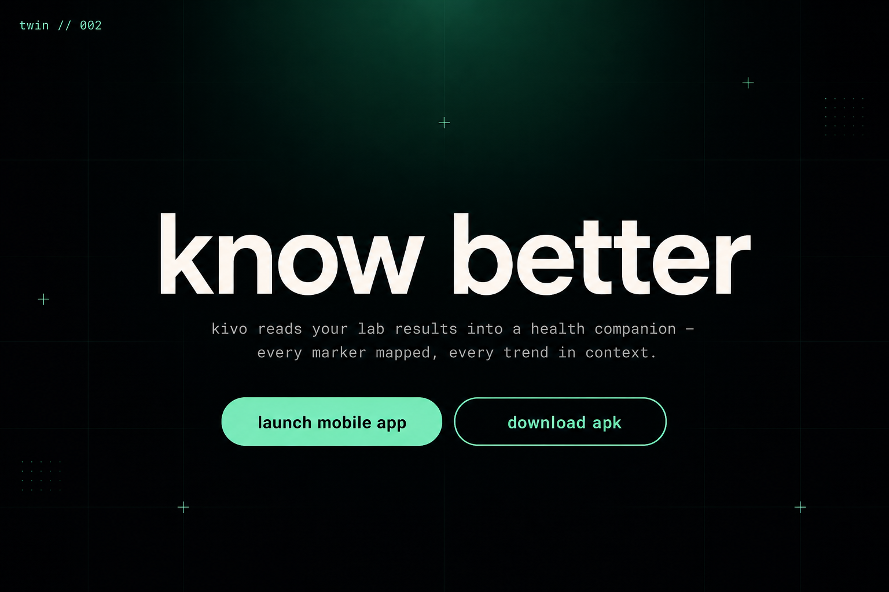
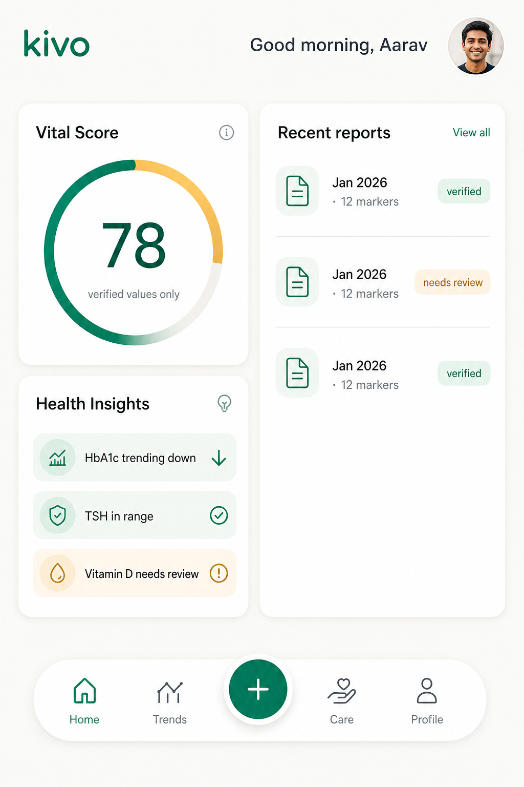
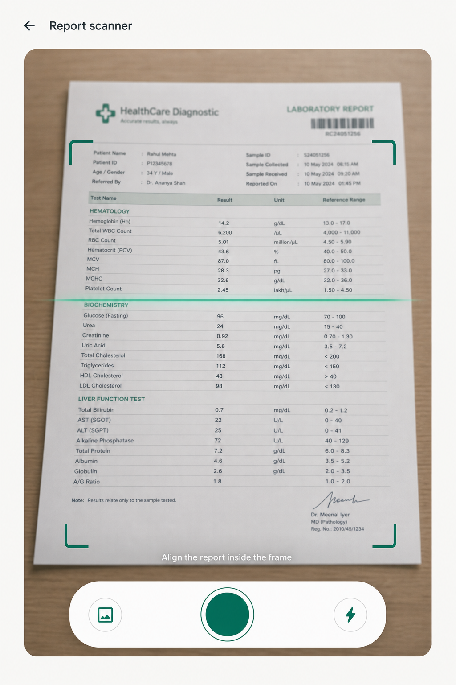
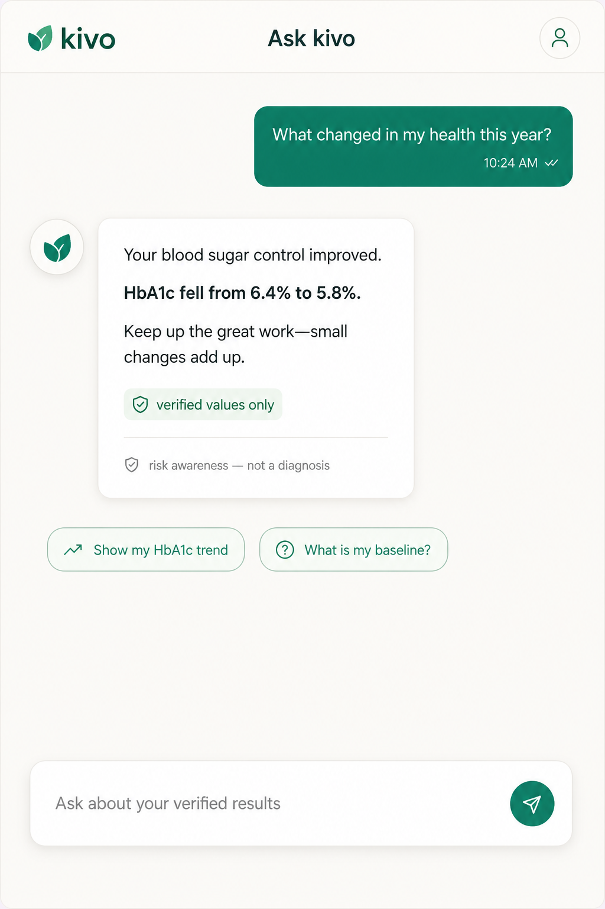
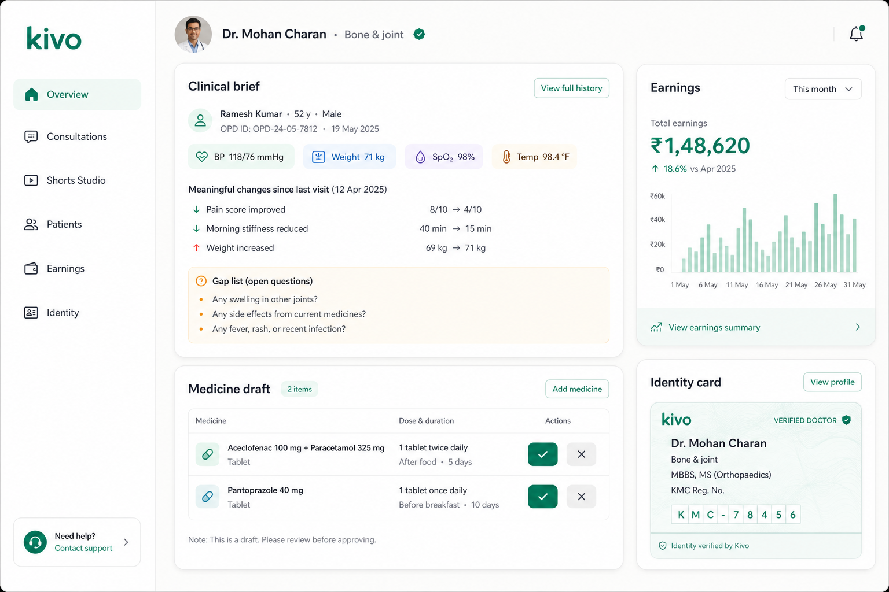
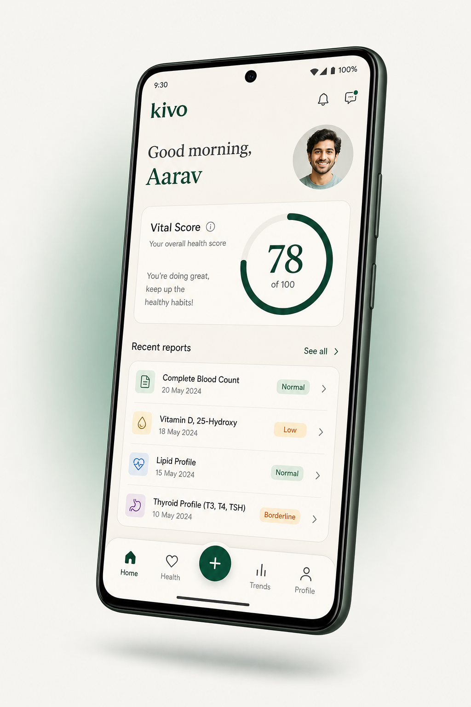
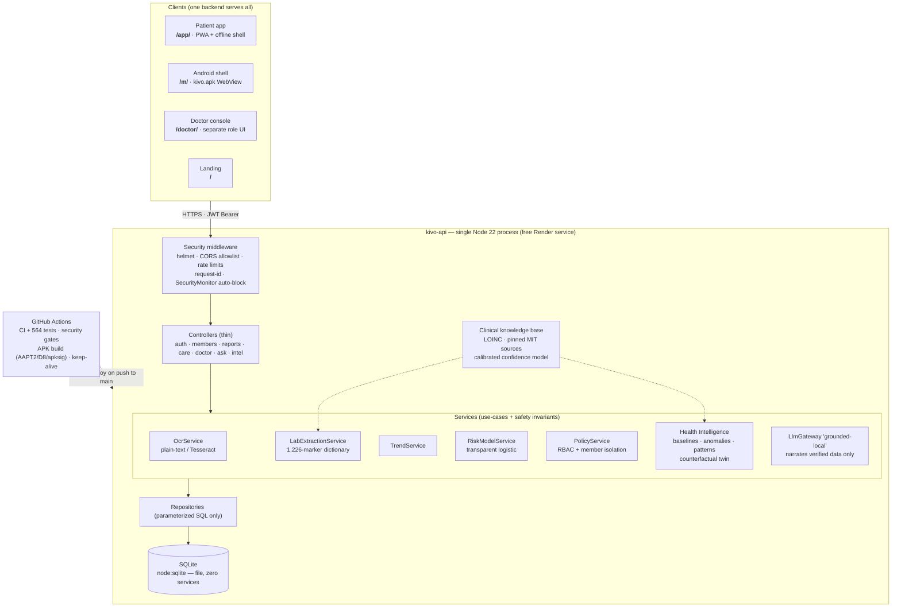
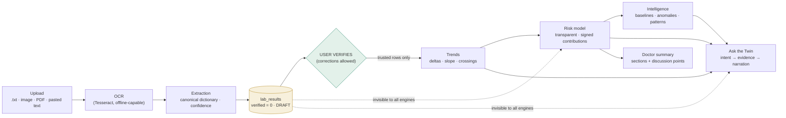
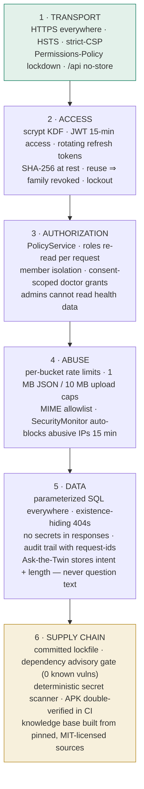

<div align="center">

# 🌿 kivo

**MedTwin AI — the AI-Powered Digital Health Twin**

Turn scattered paper lab reports into a **living, understandable health timeline**:
point your camera at a report → OCR → value extraction → **you verify** →
Digital Health Twin → longitudinal trends → explainable risk awareness →
grounded answers → walk into your doctor's visit prepared.

[](https://kivo-api-qzqc.onrender.com)
[](https://kivo-api-qzqc.onrender.com/app/)
[](https://kivo-api-qzqc.onrender.com/doctor/)
[](https://kivo-api-qzqc.onrender.com/download/apk)
[](#-testing)
[](#-security)
[](#-tech-stack)
[](LICENSE)
[](https://kivo-api-qzqc.onrender.com)

**Built by [Sambit Swain](https://github.com/ssambit635-svg) · iQOO Hackathon 2026 — HealthTech track**

</div>

---

## 🚀 Live right now

Everything below runs on **one free Render service** — API, patient app, doctor console and the
APK download, all from a single Node process + SQLite. No external databases, no paid services.

| Surface | Link |
|---|---|
| 🌐 **Landing site** | [https://kivo-api-qzqc.onrender.com](https://kivo-api-qzqc.onrender.com) |
| 📱 **Patient app** (PWA, phone-first) | [https://kivo-api-qzqc.onrender.com/app/](https://kivo-api-qzqc.onrender.com/app/) · [mobile shell /m/](https://kivo-api-qzqc.onrender.com/m/) |
| 🩺 **Doctor console** (separate role UI) | [https://kivo-api-qzqc.onrender.com/doctor/](https://kivo-api-qzqc.onrender.com/doctor/) |
| 🔌 **API health** | [https://kivo-api-qzqc.onrender.com/api/health](https://kivo-api-qzqc.onrender.com/api/health) |
| 📲 **Android APK** (`kivo.apk`) | [https://kivo-api-qzqc.onrender.com/download/apk](https://kivo-api-qzqc.onrender.com/download/apk) · [releases/tag/apk-latest](https://github.com/ssambit635-svg/kivo/releases/tag/apk-latest) |

**Seeded demo accounts** (re-seeded on every boot):

| Role | Email | Password |
|---|---|---|
| Patient | `demo@kivo.dev` | `Kivo!Demo#2026` |
| Doctor | `dr.mohan@kivo.dev` | `Kivo!Doctor#2026` |

> Free-tier honesty (stated, not hidden): the service sleeps after ~15 min idle — the first
> request wakes it in ~30–60 s, and the Android app auto-retries through the wake. The disk is
> ephemeral, so the demo journey is re-seeded on boot; a paid instance + persistent disk removes
> both limits. See [Permanent cloud deploy](#-permanent-cloud-deploy-free-no-laptop).

---

## 📸 Screenshots

| | |
|---|---|
|  |  |
| *Landing — "know better"* | *Patient app — Vital Score, insights, verified reports* |
|  |  |
| *Camera report scanner — real photo OCR (Tesseract)* | *Ask the Twin — grounded answers, verified values only* |
|  |  |
| *Doctor console — clinical brief, medicine draft, earnings* | *`kivo.apk` — installable Android shell (edge-to-edge)* |

---

## ✨ What kivo is

kivo (MedTwin AI) is a **personal digital health twin**: it reads your lab reports — including
**photos of paper reports** — maps every marker to the standard clinical dictionary (LOINC),
lets **you** verify what the machine read, and then builds a longitudinal picture of your health:
trends, personal baselines, anomalies, a transparent risk model and grounded, plain-language
answers you can take to your doctor.

It is a **risk-awareness prototype, not a diagnosis engine** — and the architecture is built so
it *cannot* accidentally become one (details in [Safety principles](#-safety-principles-baked-into-the-code)).

### The product in 60 seconds

1. **Scan** — camera (`getUserMedia`) or gallery; the photo is OCR'd on-device-capable
   (Tesseract language data can be vendored for fully offline OCR).
2. **Extract** — 1,226-marker clinical dictionary (1,219 with LOINC codes, 18 panels)
   canonicalizes names, units and reference ranges; every value lands as a **draft**
   (`verified=0`) with a confidence score from a calibrated extraction model.
3. **Verify** — *you* confirm or correct each value. This is the safety gate: trends, risk,
   intelligence and Ask-the-Twin can only ever read **verified** rows.
4. **Twin** — longitudinal trends, health-score timeline, personal baselines, multivariate
   anomaly detection, pattern graph and a counterfactual "what-if" twin.
5. **Ask** — grounded conversational Q&A: deterministic intent → evidence from verified data →
   narration that copies numbers verbatim. Diagnosis questions are refused, always.
6. **Care** — consent-scoped doctor consultations, doctor-recorded video shorts, a mock-money
   Care+ subscription (₹199/₹1499) and an audited payout ledger — built as a mock-gateway MVP
   on purpose: **no card or UPI detail is ever collected.**

---

## 🏗️ Architecture

### System overview



### The AI pipeline — verification-gated by design



Key rule: **draft rows are invisible to every intelligence engine.** The only path from a
photograph to an insight goes through a human "yes, that's my value".

### Layered backend (OOP)

```
HTTP ──► Controllers (thin) ──► Services (use-cases + safety invariants)
                                    │
                PolicyService (authZ)   LlmGateway / OCR / Trend / Risk engines
                                    │
                          Repositories (SQL, no authZ) ──► Database (node:sqlite)
```

- Domain entities sanitize themselves (`User.toJSON()` can never leak `password_hash`).
- Repositories know SQL but nothing about permissions.
- Services enforce invariants: verification gates, immutability of verified reports, disclaimers.
- `PolicyService` is the single authorization brain; roles are **re-read on every request**.
- Full endpoint map, care-network API and intelligence docs: [`backend/README.md`](backend/README.md).

---

## ⚡ Quick start (local, zero cost)

```bash
git clone https://github.com/ssambit635-svg/kivo.git
cd kivo/backend
npm install

npm start          # API on :8080 — SQLite file DB, zero external services
                   # patient app:     http://localhost:8080/app/
                   # doctor console:  http://localhost:8080/doctor/

npm test           # 564 tests — unit + integration, in-memory DB
npm run smoke      # boots the real server & exercises EVERY endpoint (120 checks)
npm run seed:demo  # demo patient + demo doctor + 2 shorts (prints both logins)
npm run ocr:setup  # ONE-TIME: vendor Tesseract language data for offline image OCR
npm run security:all  # secret scan + header posture + dependency advisory gate
node scripts/create-admin.js admin@clinic.dev 'Admin' 'Str0ng!Passw0rd#x'
```

Requirements: **Node ≥ 20.13** (CI runs 22). No Docker, no Redis, no Postgres — the built-in
`node:sqlite` is the whole database.

---

## ☁️ Permanent cloud deploy (free, no laptop)

The whole product runs on **one free Render web service**. Code lives on GitHub; every push to
`main` auto-deploys.

[](https://render.com/deploy?repo=https://github.com/ssambit635-svg/kivo)

1. Click **Deploy to Render** (or render.com → *New + → Blueprint* → this repo). Render reads
   [`render.yaml`](render.yaml) and provisions the free service — it generates a strong
   `JWT_SECRET` automatically and sets `SEED_DEMO_ON_BOOT=1`.
2. Copy your service URL (yours: **`https://kivo-api-qzqc.onrender.com`**).
3. Paste it into [`android/default-server.txt`](android/default-server.txt) and commit — CI
   rebuilds `kivo.apk` with the server baked in, so the app opens straight into kivo everywhere.
4. Optional: repository variable `KIVO_SERVER_URL` activates the
   [keep-alive workflow](.github/workflows/keep-alive.yml) so the free tier never sleeps
   in front of an audience.

---

## 📲 Android app (`kivo.apk`)

A thin, dependency-free **WebView shell** — no AndroidX, no Kotlin, no third-party SDK.
`ai.kivo.app` · minSdk 24 / targetSdk 34. It adds what a browser tab cannot: a launcher icon,
camera + microphone runtime grants for the scanner and voice journal, a gallery file chooser, a
surface switcher (`/m/`, `/app/`, `/doctor/`) and real error screens instead of a blank page.

```bash
cd backend && npm run apk:build     # local SDK if present, otherwise drives GitHub Actions via gh
```

The APK is **built by the real Android toolchain in CI** (AAPT2 + javac + D8 + apksig v1/v2) and
**verified twice before publication** (`apksigner` + `aapt2 dump badging`, then an independent
[`android/tools/verify_apk.py`](android/tools/verify_apk.py) that re-checks the container, binary
manifest, resource table, DEX checksums and both signature schemes). Details and the
hand-built-APK post-mortem: [`android/README.md`](android/README.md).

---

## 🔐 Security

Security is a **design constraint, not a checklist** — the same invariants that make kivo
medically safe (verified data only) are what make it hard to abuse. Six layers, all automated,
all running in CI on every push.

### Defense in depth



### 1 · Transport & headers (helmet + custom posture)

| Control | Detail |
|---|---|
| CSP | Strict, self-hosted fonts only (no third-party exfiltration vectors) |
| HSTS · `X-Content-Type-Options` · frame/referrer policy | Set on every response |
| `Permissions-Policy` | camera/mic **self-only**; geolocation, payment, USB **denied** |
| Caching | `Cache-Control: no-store` on **all of `/api`** — health data is never cached anywhere |
| CORS | Explicit origin allowlist; unknown origins denied (asserted by the header-posture check) |

### 2 · Authentication

- **Passwords** — `scrypt` (per-user salt, constant-time verify). Policy: ≥12 chars,
  upper/lower/digit/symbol, deny-list + email-name ban.
- **Access tokens** — JWT (HS256), **15 min**, claim `tv` = user's `token_version`.
  Password change / logout-all / admin-disable **bumps the version → old tokens die immediately**.
- **Refresh tokens** — opaque 48-byte random, **SHA-256 hashed at rest**, **rotated on every use**.
  Presenting a rotated token = theft signal → the **whole token family is revoked** +
  `auth.refresh_reuse_detected` audit event.
- **Brute force** — 5 failed logins → 15-min lockout; unknown emails still pay a scrypt verify
  (timing-blunting); every outcome is audit-logged.
- **Production boot** — the config **refuses to start** without a real `JWT_SECRET`
  (Render generates one; `render.yaml`).

### 3 · Authorization (RBAC + member isolation)

Roles live in `user_roles` (`patient` / `doctor` / `admin`), are granted **server-side only** and
**re-read on every request** — suspending a role binds on the very next call, even with a live
token. Access is derived **from the resource's owning member, never from caller-supplied ids**.

| Actor | Member read | Member write | Shares | Health data |
|---|---|---|---|---|
| Owner | ✅ | ✅ | ✅ | own members |
| Shared `viewer` | ✅ | ❌ 403 | ❌ | granted member only |
| Shared `editor` | ✅ | ✅ | ❌ | granted member only |
| Stranger | ❌ 404 (hidden) | ❌ 404 | ❌ | — |
| Doctor | ❌ 403 on patient API | ❌ | ❌ | **only via a live, scoped, expiring consent grant** |
| Admin | ❌ 404 | ❌ | ❌ | **admins cannot read health data** — accounts + audit only |

**Doctor consent model** — a doctor sees a chart only while a live grant exists for that
consultation (`doctor_access_grants`: scope = which chart sections, expiry, revocable by the
patient any time). Revoking consent makes the brief vanish and blocks replies
(`403 CONSENT_REQUIRED`); every chart view is audited (`doctor.chart_viewed`).

### 4 · Abuse defense (automated, zero-dependency)

- **Rate limits** — strict bucket for auth endpoints, global bucket for the rest (in-memory
  fixed window; no Redis).
- **Payload discipline** — 1 MB JSON cap, 10 MB upload cap, MIME allowlist, random on-disk names.
- **SecurityMonitor** — cross-endpoint abuse detection: 401/403s per IP counted in a rolling
  window; exceeding the threshold → **IP auto-blocked 15 min** (429 + `Retry-After`) + audit
  event `security.ip_blocked`. Validation 400/404s never count; blocks auto-expire; a monitor
  fault degrades *open* (never weakens auth).

### 5 · Data safety & medical safety (the same gate protects both)

- **Verified-only pipeline** — OCR/extracted values are drafts; trends, risk, intelligence and
  Ask-the-Twin can only read user-verified rows (see [pipeline](#-architecture)).
- **Ask the Twin privacy** — the audit event stores **intent + length only, never the question
  text**; answers quote verified values only; diagnosis-seeking questions are refused and
  reframed onto recorded data.
- **No fabricated ranges** — only hand-authored markers carry a typical range; the other 1,209
  are `report-only`, compared against the range printed on the user's own report.
- **Mock money only** — every payment row carries `mode: 'mock'`, `provider: 'mock-gateway'`;
  no gateway is ever contacted and **no card/UPI detail is ever collected**; demo KYC is
  labelled `mock` everywhere it is shown.
- **APK integrity** — double-verified in CI before publication (see [Android app](#-android-app-kivoapk)).

### 6 · Automated security gates (run locally and in CI)

```bash
cd backend
npm run security:all     # the whole chain:
                         #  1. security:scan   — deterministic in-repo secret scanner
                         #                       (cloud keys, key material, JWT literals,
                         #                        secret assignments, bearer tokens)
                         #  2. security:headers— boots the REAL app and asserts full posture:
                         #                       CSP, HSTS, nosniff, frame/referrer,
                         #                       Permissions-Policy, no-store, CORS denial,
                         #                       JSON-only errors, monitor + audit wiring
                         #  3. security:deps   — dependency advisory gate over the committed
                         #                       lockfile (0 known vulnerabilities)
npm run smoke            # 120-check live-endpoint smoke, incl. token rotation/reuse,
                         # lockout surfaces, isolation and security probes
```

The same chain runs in [`.github/workflows/ci.yml`](.github/workflows/ci.yml) on every push/PR
to `main`, together with the full test suite, knowledge invariants and the smoke test.

### OWASP alignment

| OWASP Top 10 (2021) | kivo's control |
|---|---|
| A01 Broken Access Control | PolicyService matrix · consent grants · per-request role re-read · existence-hiding 404s |
| A02 Cryptographic Failures | scrypt · JWT HS256 with rotation · hashed refresh tokens · HSTS · no-store |
| A03 Injection | parameterized SQL everywhere (SQLi asserted by tests) · zod validation |
| A04 Insecure Design | verification gate · admins can't read health · no diagnosis path · mock billing |
| A05 Security Misconfiguration | prod boot without secret fails · strict CSP · Permissions-Policy · lockfile + Node 22 |
| A06 Vulnerable Components | advisory gate on committed lockfile (0 known vulns) · pinned knowledge sources |
| A07 Auth Failures | lockout · timing-blunting · reuse detection · token-version kill switch |
| A08 Integrity Failures | double-verified APK · content lint on doctor uploads · immutable verified reports |

---

## 🧪 Testing

| Suite | Command | Result |
|---|---|---|
| Unit + integration (in-memory DB) | `cd backend && npm test` | **564 passing** in 43 files |
| Live endpoint smoke (boots the real server) | `npm run smoke` | **120 checks** across every endpoint |
| Clinical knowledge invariants | `npm run knowledge:verify` | determinism + data-safety invariants |
| Security gates | `npm run security:all` | secret scan · header posture · dependency audit |
| Browser E2E (Playwright) | `npm run test:browser` | landing + app flows |
| CI | `.github/workflows/ci.yml` | all of the above on every push/PR |

Coverage highlights: auth (rotation/reuse/lockout/password-change) · authorization (isolation,
viewer/editor, admin self-admin) · reports (ingest → review → verify → immutability → explain) ·
**real image OCR** (photo → extract → verify → trends, incl. Tesseract offline fallback) ·
health intelligence (trends/risk/what-if/summary) · ask-twin (intents/grounding/refusal/audit
privacy) · auto-defense (no-store/Permissions-Policy/IP auto-block) · care subscriptions (mock
billing, entitlements, plan quota) · doctor console (apply/KYC/roles/videos/consult flow/RBAC
both ways) · care media (upload → signed URL → Range/expiry/tamper + paywall).

---

## 🧠 Clinical knowledge base

[`backend/knowledge/`](backend/knowledge) is a committed, deterministic knowledge base: which
tests a report can contain, what they're called on real layouts, units, **LOINC identity**,
panels, and how much to trust a value read off a photograph. **1,226 markers — 1,219 with a
LOINC code, 18 panels** — built offline from sources **pinned by commit** (see
[References](#-references)):

```bash
cd backend
npm run knowledge:verify   # determinism + data-safety invariants
npm run knowledge:build    # rebuild from vendored sources
npm run knowledge:train    # rebuild the extraction-confidence calibration
curl localhost:8080/api/meta/knowledge   # public transparency report
```

The extraction-confidence model is calibrated on a documented OCR-noise corpus
(**Brier 0.15 → 0.07, ECE 0.26 → 0.06**) and ships with a model card.

---

## 🧰 Tech stack

| Layer | Choice | Why |
|---|---|---|
| Runtime | **Node.js ≥ 20.13** (CI: 22) | one process runs everything |
| API | **Express** + **helmet** + **zod** | battle-tested, minimal surface |
| Database | **`node:sqlite`** (built-in) | zero external services, zero bill |
| Auth | **jsonwebtoken** · **scrypt** (node:crypto) | no paid/native dependencies |
| Uploads | **multer** (MIME allowlist, caps) | random on-disk names |
| OCR | **tesseract.js** (offline-capable) + plain-text provider | photo OCR with graceful degradation |
| Frontend | **Vanilla HTML/CSS/JS** ("Verdant" design system, self-hosted fonts) | zero build step, CSP-friendly, PWA |
| Android | WebView shell, **AAPT2/D8/apksig** in CI | no AndroidX/Kotlin/SDK dependency |
| Deploy | **Render** free tier via [`render.yaml`](render.yaml) | one permanent HTTPS URL |
| CI/CD | **GitHub Actions** (`ci.yml`, `android.yml`, `keep-alive.yml`) | tests + security gates + APK pipeline |

---

## 📁 Project structure

```
kivo/
├── README.md                  ← you are here
├── LICENSE                    ← MIT (Sambit Swain)
├── render.yaml                ← free-tier cloud blueprint (auto-deploy)
├── docs/screenshots/          ← product screenshots
├── MedTwin_AI_Context.md      ← product context & rules
├── HACKATHON_GAP_ANALYSIS.md  ← strategy & gap analysis
├── backend/
│   ├── src/                   ← layered: controllers · services · repositories · domain
│   ├── knowledge/             ← 1,226-marker LOINC dictionary + calibration (pinned sources)
│   ├── scripts/               ← seed · smoke · security:all · knowledge:* · apk:build · ocr:setup
│   └── tests/                 ← 564 tests (unit + integration) + Playwright browser tests
├── frontend/
│   ├── landing/               ← public site (/)
│   ├── m/                     ← phone-first mobile shell (/m/)
│   ├── doctor/                ← doctor console (/doctor/) — separate role UI
│   └── (app)                  ← patient app (/app/) · PWA manifest + service worker
│   └── kivo.apk               ← CI-built signed Android app (served at /download/apk)
├── android/                   ← APK build pipeline, verification tool, docs
└── .github/workflows/         ← ci.yml · android.yml · keep-alive.yml
```

---

## 📚 References

1. **LOINC** — Logical Observation Identifiers Names and Codes. The universal identifier system
   for laboratory observations; 1,219 of kivo's 1,226 markers carry a LOINC code.
   https://loinc.org
2. **MIT-LCP / mimic-code** (MIT License) — item ↔ LOINC mapping tables and concept SQL used to
   build the knowledge base offline, pinned by commit. Only public mapping tables are used —
   **no patient data** (MIMIC-IV itself requires credentialed PhysioNet access).
   https://github.com/MIT-LCP/mimic-code
3. **xuewenyuan / OCR-for-Medical-Laboratory-Reports** (MIT License) — the character-set source
   for the OCR repair layer over photographed reports.
   https://github.com/xuewenyuan/OCR-for-Medical-Laboratory-Reports
4. **Tesseract OCR** — the open-source OCR engine behind photo report ingestion
   (via `tesseract.js`; language data vendored for offline use).
   https://github.com/tesseract-ocr/tesseract
5. **FINDRISC** — the Finnish Diabetes Risk Score; kivo's transparent logistic risk model uses
   hand-specified, FINDRISC-**inspired prototype** coefficients (deliberately not a clinical
   re-implementation — see the safety notice below).
   https://www.findrisk.org
6. **Render** — the deployment platform for the live service (free web service + blueprint
   deploys + auto-generated `JWT_SECRET`). https://render.com
7. **GitHub Actions** — CI (tests + security gates), the Android APK pipeline and the
   keep-alive workflow. https://docs.github.com/actions
8. **iQOO Hackathon 2026** — HealthTech track; this project is a hackathon prototype.
   Strategy and gap analysis: [`HACKATHON_GAP_ANALYSIS.md`](HACKATHON_GAP_ANALYSIS.md).
9. **Node.js built-in `node:sqlite`** — the zero-dependency database at the core.
   https://nodejs.org/api/sqlite.html
10. **OWASP Top 10 (2021)** — the alignment table in [Security](#-security).
    https://owasp.org/Top10

---

## ⚕️ Safety principles baked into the code

> **Medical-safety notice:** kivo is a hackathon prototype. It produces **risk-awareness
> estimates and explanations — never diagnoses.** The risk model is transparent but
> **not clinically validated**. OCR-extracted values are drafts until a **user explicitly
> verifies** them.

- Predictions are **risk estimates with uncertainty**, always shipped with disclaimers — never
  diagnosis language.
- OCR/extracted values are **drafts (`verified=0`)**; trends & risk engines can only read
  **user-verified** rows.
- The grounded-local "LLM" narrates **only** from validated structured data — it cannot invent
  numbers or evidence.
- Reference ranges from the **report itself** always win over typical defaults.
- Admins **cannot** read members' health data; family isolation is enforced by `PolicyService`
  and tested end-to-end.
- **Ask the Twin never diagnoses** — diagnosis-seeking questions are refused and reframed onto
  recorded data; answers quote verified values only; question text is never written to the audit
  trail.
- No patient data exists in the knowledge base; plausibility bounds are physical (suspected OCR
  misreads), never clinical judgements.

---

## 🤝 Contributing

Issues and PRs are welcome. Before pushing:

```bash
cd backend
npm test && npm run smoke && npm run security:all && npm run knowledge:verify
```

Product rules live in [`MedTwin_AI_Context.md`](MedTwin_AI_Context.md) — especially the
verification-gate and no-diagnosis invariants. CI runs the full gate chain on every PR to
`main`.

---

## 📄 License

Released under the **MIT License** — see [`LICENSE`](LICENSE).

Vendored knowledge-base sources retain their own licenses (MIT — see
[References](#-references) and [`backend/knowledge/README.md`](backend/knowledge/README.md)).

---

<div align="center">

**kivo — your body, understood.**

Built with ❤️ (and a lot of verified data) by **[Sambit Swain](https://github.com/ssambit635-svg)**

[Live site](https://kivo-api-qzqc.onrender.com) · [Patient app](https://kivo-api-qzqc.onrender.com/app/) ·
[Doctor console](https://kivo-api-qzqc.onrender.com/doctor/) · [APK](https://kivo-api-qzqc.onrender.com/download/apk) ·
[GitHub](https://github.com/ssambit635-svg/kivo)

</div>
